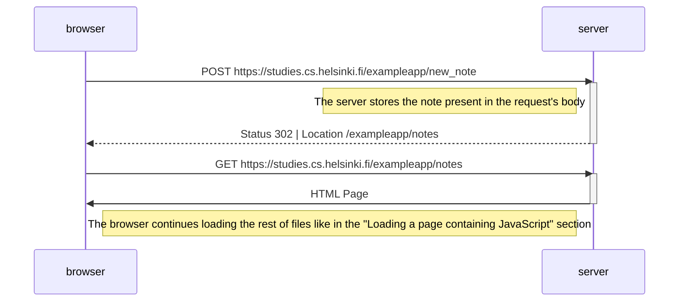

```mermaid
sequenceDiagram
    participant browser
    participant server

    browser->>server: POST https://studies.cs.helsinki.fi/exampleapp/new_note
    activate server
    Note left of server: The server stores the note present in the request's body
    server-->>browser: Status 302 | Location /exampleapp/notes
    deactivate server

    browser->>server: GET https://studies.cs.helsinki.fi/exampleapp/notes
    activate server
    server->>browser: HTML Page
    deactivate server

    Note right of browser: The browser continues loading the rest of files like in the "Loading a page containing JavaScript" section
```