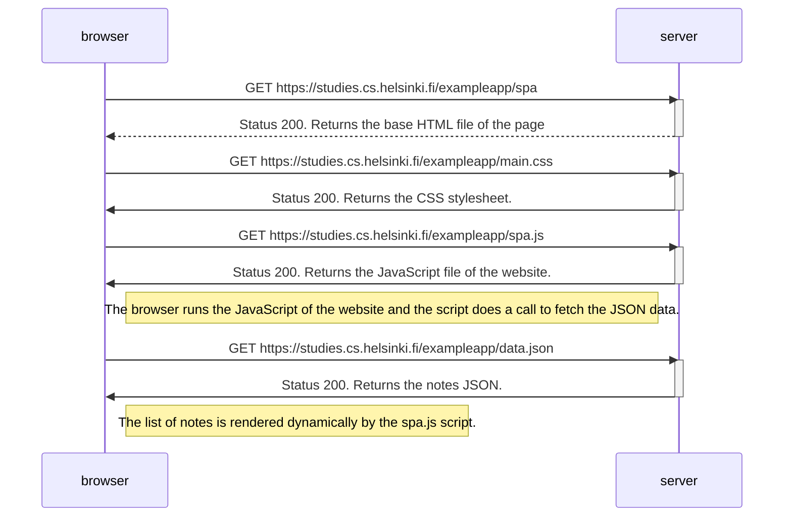

```mermaid
sequenceDiagram
    participant browser
    participant server

    browser->>server: GET https://studies.cs.helsinki.fi/exampleapp/spa
    activate server
    server-->>browser: Status 200. Returns the base HTML file of the page
    deactivate server

    browser->>server: GET https://studies.cs.helsinki.fi/exampleapp/main.css
    activate server
    server->>browser: Status 200. Returns the CSS stylesheet.
    deactivate server

    browser->>server: GET https://studies.cs.helsinki.fi/exampleapp/spa.js
    activate server
    server->>browser: Status 200. Returns the JavaScript file of the website.
    deactivate server

    Note right of browser: The browser runs the JavaScript of the website and the script does a call to fetch the JSON data.

    browser->>server: GET https://studies.cs.helsinki.fi/exampleapp/data.json
    activate server
    server->>browser: Status 200. Returns the notes JSON.
    deactivate server

    Note right of browser: The list of notes is rendered dynamically by the spa.js script.
```