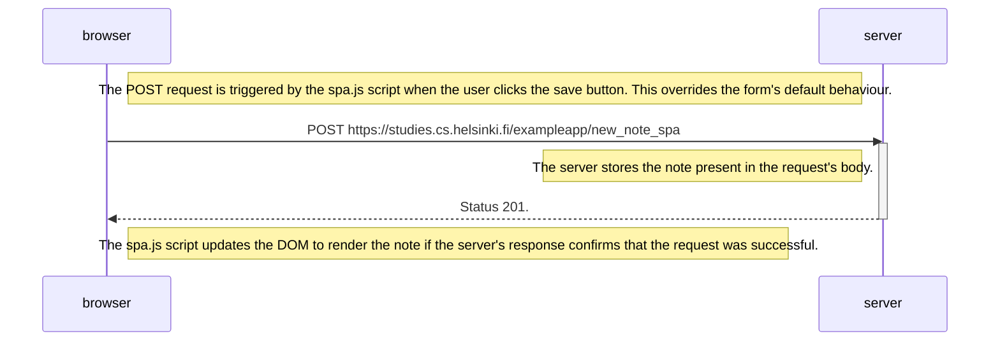

```mermaid
sequenceDiagram
    participant browser
    participant server

    Note right of browser: The POST request is triggered by the spa.js script when the user clicks the save button. This overrides the form's default behaviour. 

    browser->>server: POST https://studies.cs.helsinki.fi/exampleapp/new_note_spa
    activate server
    Note left of server: The server stores the note present in the request's body.
    server-->>browser: Status 201.
    deactivate server

    Note right of browser: The spa.js script updates the DOM to render the note if the server's response confirms that the request was successful.
```